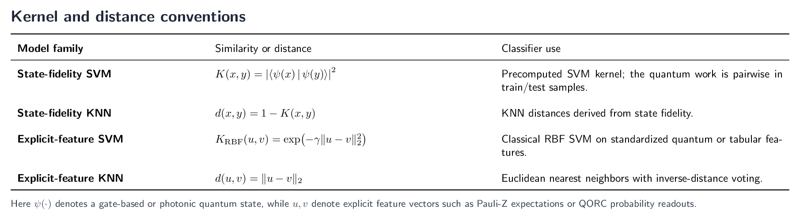

# Encrypted Network Traffic Analysis Using Quantum Machine Learning - Methods and Detailed Results

This companion file contains the detailed model registry, kernel conventions,
configuration tables, design rationale, paper reference tables, truncation
details, and hardware notes for the qSVM/qKNN reproduction. The shorter
[README.md](README.md) keeps the main claims, commands, compact results, and
local observations.

## Detailed Model Registry

The model registry is organized around two axes: SVM versus KNN, and
fidelity/kernel-distance models versus explicit-feature models.

### SVM: State-Fidelity or Kernel-Based Models

| Model | Encoder or kernel step | Decision step |
| --- | --- | --- |
| `state_svm_angle` | PennyLane angle-encoded state amplitudes; explicit state-fidelity matrix. | `SVC(kernel="precomputed", C=qsvm_c)`. |
| `state_svm_amplitude` | PennyLane amplitude-encoded state amplitudes; explicit state fidelity. | `SVC(kernel="precomputed", C=qsvm_c)`. |
| `state_svm_zz` | ZZ feature-map state amplitudes; explicit state fidelity. | `SVC(kernel="precomputed", C=qsvm_c)`. |
| `photonic_state_svm_angle` | MerLin QORC amplitudes; explicit state fidelity. | `SVC(kernel="precomputed", C=photonic_fidelity_qsvm_c)`. |
| `qsvm_angle`, `qsvm_amplitude`, `qsvm_zz` | Authors' original-style PennyLane pairwise fidelity-kernel implementations kept for validation. | `SVC(kernel="precomputed")`. |
| `photonic_fidelity_svm_angle` | Legacy MerLin `FidelityKernel` path kept for validation. | `SVC(kernel="precomputed")`. |

### SVM: Explicit-Feature Models

| Model | Feature step | Decision step |
| --- | --- | --- |
| `svm_classical` | No quantum encoder; cleaned tabular features. | `SVC(kernel="rbf", C=1.0, gamma="scale")`. |
| `hybrid_svm_angle` | Angle embedding; one Pauli-Z expectation per qubit; StandardScaler. | `SVC(kernel="rbf")`. |
| `hybrid_svm_amplitude` | Amplitude embedding; one Pauli-Z expectation per qubit; StandardScaler. | `SVC(kernel="rbf")`. |
| `hybrid_svm_zz` | ZZ feature map; one Pauli-Z expectation per qubit; StandardScaler. | `SVC(kernel="rbf")`. |
| `photonic_hybrid_svm_angle` | MerLin QORC reservoir probabilities; StandardScaler. | `SVC(kernel="rbf", C=photonic_qsvm_c, gamma="scale")`. |
| `photonic_hybrid_svm_amplitude` | MerLin amplitude state, fixed Haar unitary, QORC probabilities; StandardScaler. | `SVC(kernel="rbf", C=photonic_qsvm_c, gamma="scale")`. |

### KNN: State-Fidelity Distance Models

| Model | Encoder or kernel step | Decision step |
| --- | --- | --- |
| `state_knn_angle` | PennyLane angle-encoded state amplitudes. | KNN on `1 - fidelity`, `k=5`. |
| `state_knn_amplitude` | PennyLane amplitude-encoded state amplitudes. | KNN on `1 - fidelity`, `k=5`. |
| `state_knn_zz` | ZZ feature-map state amplitudes. | KNN on `1 - fidelity`, `k=5`. |
| `photonic_state_knn_angle` | MerLin QORC amplitudes. | KNN on `1 - fidelity`, `k=5`. |
| `qknn_angle`, `qknn_amplitude`, `qknn_zz` | Authors' original-style PennyLane state-fidelity KNN path. | KNN on state-fidelity distances. |
| `photonic_fidelity_knn_angle` | Legacy MerLin `FidelityKernel` converted to distances. | KNN on `1 - fidelity`, `k=5`. |

### KNN: Explicit-Feature Models

| Model | Feature step | Decision step |
| --- | --- | --- |
| `knn_classical` | No quantum encoder; cleaned tabular features. | `KNeighborsClassifier(k=7, metric="euclidean", weights="distance")`. |
| `hybrid_knn_angle` | Angle embedding; one Pauli-Z expectation per qubit; StandardScaler. | KNN on explicit features. |
| `hybrid_knn_amplitude` | Amplitude embedding; one Pauli-Z expectation per qubit; StandardScaler. | KNN on explicit features. |
| `hybrid_knn_zz` | ZZ feature map; one Pauli-Z expectation per qubit; StandardScaler. | KNN on explicit features. |
| `photonic_hybrid_knn_angle` | MerLin QORC reservoir probabilities; StandardScaler. | KNN on Euclidean L2 distances between standardized probability features. |
| `photonic_hybrid_knn_amplitude` | MerLin amplitude state, fixed Haar unitary, QORC probabilities; StandardScaler. | KNN on Euclidean L2 distances between standardized probability features. |

## Kernel and Distance Conventions

The source for this formula panel is kept in
[`assets/kernel_distance_formulas.tex`](assets/kernel_distance_formulas.tex).

The state-fidelity SVMs do not use an RBF kernel. They encode each input as a
quantum state and use the fidelity
`K(x, y) = fidelity(psi(x), psi(y))` as a custom precomputed kernel. The
legacy `qsvm_*` and `photonic_fidelity_svm_angle` paths compute this pairwise
kernel directly; the faster `state_svm_*` and `photonic_state_svm_angle` paths
compute state amplitudes once and then form the same Hermitian inner products
explicitly.

The hybrid SVMs use quantum circuits as feature maps first, then apply a
classical RBF SVM to the resulting explicit features. Gate-based hybrid models
read one Pauli-Z expectation per qubit. QORC hybrid models read photonic
reservoir probability features. Both feature families are standardized before
the SVM. This matches the authors' hybrid notebooks, where `SVC()` uses
scikit-learn's default RBF kernel, and the paper appendix reports
`gamma="scale"` with an RBF kernel for hybrid SVMs.

For KNN, the curated explicit-feature models use ordinary Euclidean distances.
State-fidelity KNN variants use the corresponding quantum distance
`1 - fidelity`. A small diagnostic on the URL2016 QORC hybrid amplitude
features compared Euclidean KNN with cosine and cosine-plus-L2 KNN; the cosine
variants did not improve the classification metrics, so Euclidean distance
remains the default. The RBF SVM also depends on Euclidean squared distance,
but it uses that similarity inside a margin-based classifier rather than the
local voting rule used by KNN.

## Detailed Configuration

`cli.json` is the authoritative schema for paper-specific CLI flags. After
cleaning and feature selection, circuit sizes are inferred from the retained
feature view. Gate-based angle and ZZ encoders use one qubit per retained
feature. Gate-based amplitude encoding uses the smallest qubit register able
to hold the retained vector, with PennyLane handling padding and
normalization. Photonic angle reservoirs use one mode per retained feature
when `photonic_n_modes: null`; photonic amplitude reservoirs choose the
smallest configured photonic basis, given the photon count and computation
space, that can contain the retained feature vector.

### Data and Split Parameters

| Key | Meaning |
| --- | --- |
| `data_source` | `synthetic` for file-free smoke runs, `csv` for CIC datasets. |
| `dataset` | `synthetic`, `url2016`, or `ids2012`. |
| `data_dir` | Dataset directory under the shared data root. Defaults to `qSVM_qKNN`. |
| `dataset_file` | URL2016 CSV path relative to `data/qSVM_qKNN`. |
| `ids_archive`, `ids_csv_files` | IDS2012 archive and selected CSV members. |
| `balance_classes` | Undersample the majority class before train/test split. Defaults to `true`. |
| `test_size` | Fraction used for the raw test split before optional class balancing. |
| `max_test_size` | Optional cap on the balanced test split. Curated configs use 2000 test points, i.e. 1000 per class when available. |
| `subset_size` | Stratified pre-split sample size; `0` uses all cleaned balanced rows. |
| `feature_limit` | Keep the highest-variance train features; `null` keeps all cleaned features. |
| `seeds` | Integer seeds used for repeated train/test splits. |

### Gate-Based Parameters

| Key | Meaning |
| --- | --- |
| `quantum_input_range`, `quantum_angle_scale` | MinMax range fit on the training split and applied to train/test samples, then angle multiplier. Angle models default to `[0, 1] -> [0, pi]`. |
| `zz_angle_scale`, `zz_reps`, `zz_entanglement`, `zz_alpha` | ZZ feature-map controls. Defaults keep the effective phase range comparable to `[0, pi]`, with one repetition. |
| `kernel_angle_rotation`, `qknn_angle_rotation`, `hybrid_angle_rotation` | Rotation axes for angle encodings. |
| `hybrid_readout` | Hybrid readout. Curated configs use `pauli_z`, one expectation value per qubit. |
| `hybrid_standardize_features` | Apply `StandardScaler` after explicit gate-based quantum features. Defaults to `true`. |
| `quantum_device` | PennyLane device, default `lightning.qubit`. `lightning.gpu` is supported when `pennylane-lightning-gpu` and a visible CUDA device are available. |

### Photonic Parameters

| Key | Default | Meaning |
| --- | ---: | --- |
| `photonic_n_modes` | `null` | Angle reservoirs use the retained feature count as modes; amplitude reservoirs choose the smallest configured photonic basis that can contain the retained feature vector. |
| `photonic_n_photons` | `3` | Input photon count in curated QORC configs. |
| `photonic_computation_space` | `UNBUNCHED` | MerLin computation space used for photonic probability/amplitude readouts. `FOCK` remains available for ablations. |
| `photonic_device`, `photonic_dtype`, `encoder_batch_size` | `cpu`, `float64`, `2048` | Torch/MerLin execution device, dtype, and shared PennyLane/MerLin encoding batch size. |
| `photonic_input_range`, `photonic_phase_scale` | `[0, 1]`, `pi` | MinMax scaling fit on the training split and applied to train/test samples; angle reservoirs apply phase encoding as `pi * x`, while amplitude reservoirs pad and L2-normalize the bounded vector. |
| `photonic_standardize_features` | `true` | Standardize photonic probability features before explicit SVM/KNN. |
| `photonic_qsvm_c` | `1.0` | Regularization for explicit-feature QORC RBF SVMs. |
| `photonic_qknn_neighbors` | `5` | Neighbors for explicit-feature QORC KNNs. |
| `photonic_fidelity_qsvm_c` | `1.0` | Regularization for photonic FidelityKernel SVM. |
| `photonic_fidelity_qknn_neighbors` | `5` | Neighbors for photonic FidelityKernel KNN. |
| `photonic_fidelity_shots` | `0` | Exact analytic probabilities by default. |
| `photonic_fidelity_force_psd` | `false` | If enabled, project the final train kernel to a PSD matrix. |

### SVM and KNN Parameters

| Key | Default | Meaning |
| --- | ---: | --- |
| `svm_kernel` | `rbf` | Kernel used by classical and explicit-feature SVMs. |
| `svm_c` | `1.0` | Regularization for classical and explicit-feature SVMs. |
| `svm_gamma` | `scale` | RBF gamma for classical and explicit-feature SVMs. |
| `qsvm_c` | `1.0` | Regularization for PennyLane state-fidelity SVMs and legacy precomputed-kernel QSVMs. |
| `knn_neighbors` | `7` | Neighbors for classical and explicit-feature KNNs. |
| `knn_metric` | `euclidean` | Metric for classical and explicit-feature KNNs. |
| `knn_weights` | `distance` | KNN voting weights. |
| `qknn_neighbors` | `5` | Neighbors for gate-based state-fidelity KNNs. |

## Design Rationale

### Dataset and Feature Truncation

The curated CLI runs intentionally truncate rows and, for all-model and MerLin
comparisons, sometimes features. This is a compute-control choice rather than a
modeling claim. The legacy fidelity-kernel variants require roughly
`n_train^2 + n_test * n_train` pairwise quantum evaluations; they remain
available in the validation configs, but the main curated configs use explicit
state amplitudes or explicit features when this gives the same SVM/KNN
semantics at much lower runtime.

This replacement is deliberate for the gate-based SVM/KNN models. Computing
all state amplitudes once and then forming the squared state fidelity gives the
same classification metrics as the pairwise kernel-trick implementation on the
validation splits, while avoiding repeated circuit evaluations for every
train/test pair. The legacy kernel-trick models are therefore kept for
reproducibility checks, and the faster explicit-state versions are used in the
main experiment configs.

Feature truncation reduces the number of qubits for gate-based encoders and
the number of modes for photonic reservoirs. The implementation keeps the
highest-variance train features after deterministic cleanup and train-fitted
categorical encoding. PCA is deliberately not used in the model preprocessing:
it would mix the original tabular fields, move away from the paper-style
feature view, and break the direct correspondence between retained features,
qubits, and photonic modes.

Because feature selection is not PCA, there is no exact "explained variance"
quantity. As a practical proxy, the table below reports the fraction of train
feature variance retained by the selected highest-variance columns.

| Config family | Dataset | Retained features | Candidate non-constant features | Train variance retained |
| --- | --- | ---: | ---: | ---: |
| Original gate-based | URL2016 | 10 | 15 | 99.3% |
| Original gate-based | IDS2012 | 10 | 10 | 100.0% |
| All models | URL2016 | 8 | 15 | 98.5% |
| All models | IDS2012 | 8 | 10 | ~100.0% |
| MerLin | URL2016 | 15 | 15 | 100.0% |
| MerLin | IDS2012 | 10 | 10 | 100.0% |
| Fast models | URL2016 | 10 | 15 | 99.3% |
| Fast models | IDS2012 | 10 | 10 | 100.0% |

### Encoders and Readouts

The gate-based angle encoder is deliberately close to the authors' code, but a
plain angle map is mostly component-wise. The ZZ feature-map variants add
pairwise feature phases and entangling operations, giving a non-trivial
gate-based encoder without introducing a trainable variational ansatz. The
default is `zz_reps: 1`, chosen as a runtime-aware setting after profiling.

All hybrid gate-based models use the same default readout: one Pauli-Z
expectation value per qubit, followed by an optional `StandardScaler`. This
keeps angle, amplitude, and ZZ explicit-feature models comparable. The
amplitude encoder still performs its required state normalization internally;
the tabular preprocessing view remains train-fitted MinMax scaling.

The photonic extension uses fixed MerLin reservoirs because reservoirs are a
natural way to turn inputs into high-dimensional quantum features without
training the quantum circuit itself. With `photonic_n_modes: null`, angle
reservoirs use one optical mode per retained feature. Amplitude reservoirs
instead choose the smallest mode count whose configured photonic basis can
contain the retained feature vector, then pad and L2-normalize the vector as a
photonic-basis state before one fixed Haar unitary. The curated configs use
`photonic_computation_space: "UNBUNCHED"`, which keeps only collision-free
outputs and is faster/smaller than the full Fock basis for the same number of
modes and photons. The hybrid photonic variants expose explicit probability
features before RBF SVM or Euclidean KNN; the state variants expose complex
amplitudes and build explicit state-fidelity matrices. The legacy MerLin
`FidelityKernel` path is kept for validation and ablations.

### Preprocessing Discipline

All learned preprocessing is fit on the training split and then applied to the
train and test splits. This includes feature selection, StandardScaler,
MinMaxScaler, categorical encodings, and post-quantum StandardScaler steps. The
datasets are also balanced by undersampling the majority class, following the
paper's evaluation policy and making accuracy, F1, and ROC-AUC easier to
compare across model families.

The implemented quantum models are feature maps, kernels, or fixed reservoirs.
They do not train a variational quantum ansatz. This keeps the reproduction
aligned with SVM/KNN-style comparisons and isolates the effect of the encoder
and the downstream classical decision rule.

## Original Paper Tables

The paper's Table 2 reports the following ISCX-URL2016 values.

| Family | Variant | Accuracy | Precision | Recall | F1 |
| --- | --- | ---: | ---: | ---: | ---: |
| SVM | Regular | 0.9634 | 0.9857 | 0.9424 | 0.9635 |
| SVM | Quantum Angle | 0.9201 | 0.9207 | 0.9208 | 0.9201 |
| SVM | Quantum Amplitude | 0.9179 | 0.9178 | 0.9180 | 0.9179 |
| SVM | Hybrid Angle | 0.9423 | 0.9674 | 0.9186 | 0.9424 |
| SVM | Hybrid Amplitude | 0.9667 | 0.9880 | 0.9467 | 0.9669 |
| KNN | Regular | 0.9874 | 0.9878 | 0.9878 | 0.9878 |
| KNN | Quantum Angle | 0.9645 | 0.9600 | 0.9673 | 0.9637 |
| KNN | Quantum Amplitude | 0.9471 | 0.9399 | 0.9521 | 0.9460 |
| KNN | Hybrid Angle | 0.9808 | 0.9848 | 0.9777 | 0.9812 |
| KNN | Hybrid Amplitude | 0.9878 | 0.9878 | 0.9885 | 0.9881 |

The paper's Table 3 reports the following ISCX-IDS2012 values.

| Family | Variant | Accuracy | Precision | Recall | F1 |
| --- | --- | ---: | ---: | ---: | ---: |
| SVM | Regular | 0.9964 | 0.9973 | 0.9955 | 0.9964 |
| SVM | Quantum Angle | 0.9488 | 0.9489 | 0.9488 | 0.9488 |
| SVM | Quantum Amplitude | 0.9893 | 0.9893 | 0.9893 | 0.9893 |
| SVM | Hybrid Angle | 0.9924 | 0.9937 | 0.9910 | 0.9924 |
| SVM | Hybrid Amplitude | 0.9942 | 0.9964 | 0.9919 | 0.9942 |
| KNN | Regular | 0.9973 | 0.9982 | 0.9964 | 0.9973 |
| KNN | Quantum Angle | 0.9946 | 0.9938 | 0.9956 | 0.9947 |
| KNN | Quantum Amplitude | 0.9911 | 0.9947 | 0.9876 | 0.9911 |
| KNN | Hybrid Angle | 0.9951 | 0.9955 | 0.9946 | 0.9951 |
| KNN | Hybrid Amplitude | 0.9973 | 0.9982 | 0.9964 | 0.9973 |

## Curated Experiment Design and Truncation

The curated results were regenerated on July 3, 2026. Raw timestamped runs
remain under `outdir/`; stable copies and aggregate artifacts are stored under
`results/`.

| Config family | Purpose |
| --- | --- |
| Original gate-based | Reproduces the authors' gate-based model family as closely as this repository setup allows, using explicit state-fidelity equivalents for the costly QSVM kernels. |
| All models | Runs every main implemented SVM and KNN model on a compact matched split. This is the broad comparability run, including ZZ and QORC state variants. |
| Fast models | Runs the most scalable explicit-feature and explicit-state models over three seeds. It excludes ZZ and legacy pairwise fidelity kernels; URL2016 uses all cleaned rows with a 10-feature cap to keep the state-amplitude models near the runtime budget. |
| MerLin | Isolates the photonic QORC variants: explicit probability features and explicit state-fidelity SVM/KNN. |
| Kernel vs state fidelity | Validation-only configs comparing legacy pairwise kernels with the faster explicit state-fidelity implementations on the all-model truncation. |

`Size without truncation` means `subset_size: 0` and `feature_limit: null`,
while keeping the same cleaning, train/test split, balancing policy, and
`max_test_size: 2000` cap.

| Dataset | Size without truncation |
| --- | ---: |
| URL2016 | 13562 train / 2000 test, 15 features |
| IDS2012 | 131118 train / 2000 test, 10 features |

| Config family | Dataset | Seeds | Curated size per seed | Total runtime |
| --- | --- | ---: | ---: | ---: |
| Original gate-based | URL2016 | 1 | 13562 train / 2000 test, 10 features | 1 min 04 s |
| Original gate-based | IDS2012 | 1 | 23358 train / 2000 test, 10 features | 2 min 20 s |
| All models | URL2016 | 1 | 7906 train / 2000 test, 8 features | 1 min 48 s |
| All models | IDS2012 | 1 | 5608 train / 2000 test, 8 features | 1 min 33 s |
| MerLin | URL2016 | 1 | 13562 train / 2000 test, 15 features | 36 s |
| MerLin | IDS2012 | 1 | 23358 train / 2000 test, 10 features | 1 min 13 s |
| Fast models | URL2016 | 3 | 13562 train / 2000 test, 10 features | 4 min 36 s |
| Fast models | IDS2012 | 3 | 14906 train / 2000 test, 10 features | 4 min 53 s |
| Kernel vs state fidelity | URL2016 | 1 | 122 train / 52 test, 8 features | 40 s |
| Kernel vs state fidelity | IDS2012 | 1 | 120 train / 50 test, 8 features | 51 s |

Complete numeric results are stored under `results/` as aggregate CSV/JSON
tables and per-config folders containing summaries, plots, timings, ROC data,
and prediction-agreement artifacts when relevant.

## Kernel vs State-Fidelity Validation

The validation configs compare the legacy pairwise kernels with the explicit
state-fidelity replacements on the same all-model truncation. Gate-based
replacements match the legacy kernel metrics exactly and are much faster for
SVM kernels. Photonic state-fidelity models are faster than the MerLin
`FidelityKernel` path, but the MerLin amplitude and kernel APIs do not produce
identical classifier outcomes in every case, so the photonic fidelity paths
remain available for ablations.

| Dataset | Kernel model | State model | Accuracy match | Kernel time | State time | Speedup |
| --- | --- | --- | ---: | ---: | ---: | ---: |
| URL2016 | `qsvm_angle` | `state_svm_angle` | yes | 2.669 s | 0.027 s | 97.1x |
| URL2016 | `qsvm_amplitude` | `state_svm_amplitude` | yes | 3.287 s | 0.025 s | 133.3x |
| URL2016 | `qsvm_zz` | `state_svm_zz` | yes | 30.343 s | 0.318 s | 95.3x |
| URL2016 | `qknn_angle` | `state_knn_angle` | yes | 0.024 s | 0.032 s | 0.7x |
| URL2016 | `qknn_amplitude` | `state_knn_amplitude` | yes | 0.030 s | 0.029 s | 1.0x |
| URL2016 | `qknn_zz` | `state_knn_zz` | yes | 0.228 s | 0.239 s | 1.0x |
| URL2016 | `photonic_fidelity_svm_angle` | `photonic_state_svm_angle` | yes | 0.602 s | 0.049 s | 12.2x |
| URL2016 | `photonic_fidelity_knn_angle` | `photonic_state_knn_angle` | no | 0.168 s | 0.011 s | 14.7x |
| IDS2012 | `qsvm_angle` | `state_svm_angle` | yes | 2.666 s | 0.045 s | 59.0x |
| IDS2012 | `qsvm_amplitude` | `state_svm_amplitude` | yes | 3.163 s | 0.024 s | 133.0x |
| IDS2012 | `qsvm_zz` | `state_svm_zz` | yes | 29.345 s | 0.318 s | 92.2x |
| IDS2012 | `qknn_angle` | `state_knn_angle` | yes | 0.023 s | 0.031 s | 0.8x |
| IDS2012 | `qknn_amplitude` | `state_knn_amplitude` | yes | 0.032 s | 0.042 s | 0.8x |
| IDS2012 | `qknn_zz` | `state_knn_zz` | yes | 0.216 s | 0.240 s | 0.9x |
| IDS2012 | `photonic_fidelity_svm_angle` | `photonic_state_svm_angle` | no | 0.565 s | 0.042 s | 13.5x |
| IDS2012 | `photonic_fidelity_knn_angle` | `photonic_state_knn_angle` | yes | 0.142 s | 0.018 s | 7.8x |

## Hardware-Aware Photonic Settings

| Field | Setting |
| --- | --- |
| Backend | MerLin CPU simulator using SLOS; see the [SLOS paper](https://arxiv.org/pdf/2206.10549). |
| Computation space | `photonic_computation_space: "UNBUNCHED"` for curated QORC probability and amplitude readouts; `FOCK` remains configurable |
| Detector model | Analytic probability readout; no finite-shot detector sampling by default |
| Photons | `photonic_n_photons: 3` in curated configs |
| Modes | `photonic_n_modes: null`; angle encoding uses the retained feature count, amplitude encoding uses the smallest compatible configured photonic basis |
| Input state | Angle encoding: deterministic Fock input state with photons spread across available modes. Amplitude encoding: data vector padded and normalized as a photonic-basis state. |
| Encoding | Angle encoding: MinMax scaling fit on train and applied to train/test, then phases `pi * x`. Amplitude encoding: the same train-fitted MinMax view, padding, and L2 normalization. |
| Measurement | QORC probability vector, QORC complex amplitudes, or legacy fidelity-kernel value, depending on the model |
| Postselection | None |
| Shot count | `photonic_fidelity_shots: 0` unless overridden |
| Wall-clock time | Reported in `summary.csv`, `metrics.json`, and runtime profile figures |
