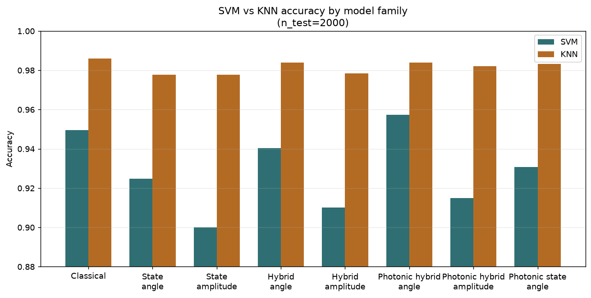
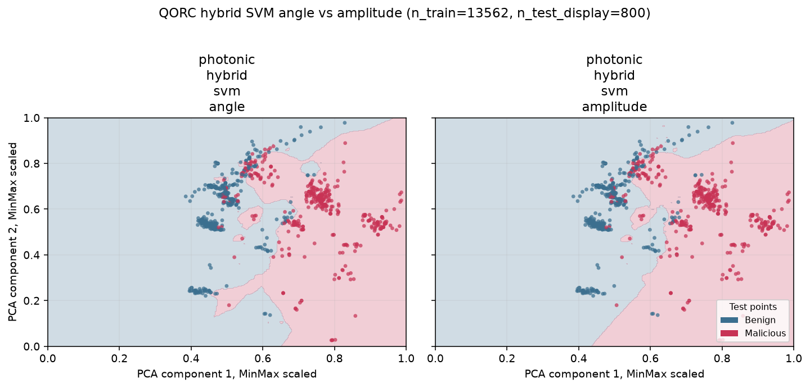
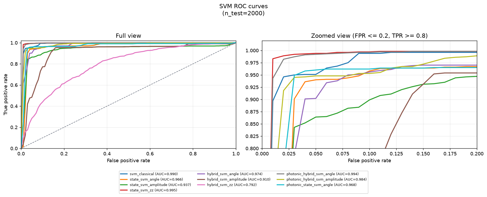
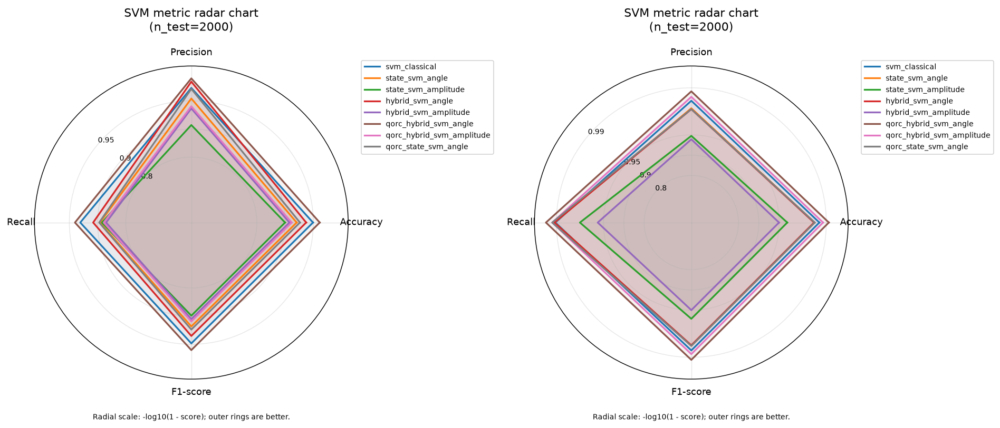
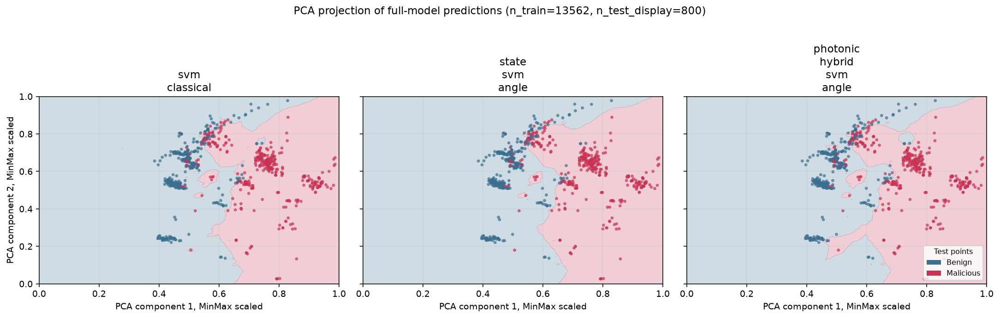
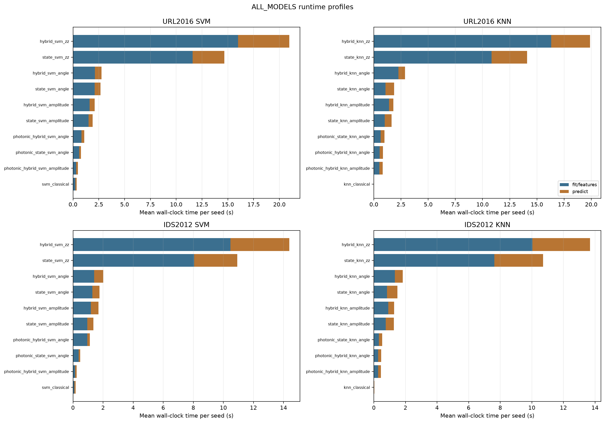
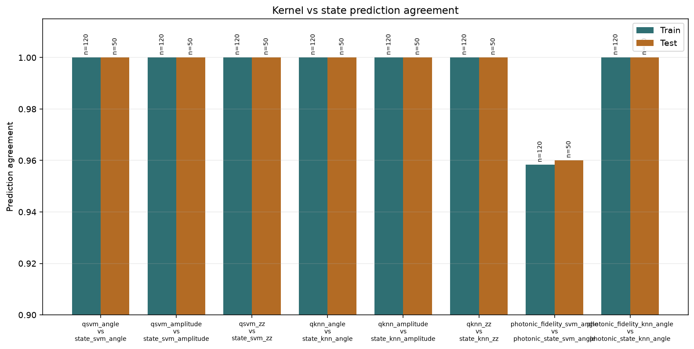

# Encrypted Network Traffic Analysis Using Quantum Machine Learning - Reproduction

## Reference and Attribution

> Gokul Sunil Sodar, Akshay Murthy, Annapurna Jonnalagadda, and
> Aswani Kumar Cherukuri.
> "Encrypted network traffic analysis using quantum machine learning."
> EPJ Quantum Technology, article in press, 2026.
> DOI: <https://doi.org/10.1140/epjqt/s40507-025-00459-7>

The authors' code is referenced in the paper as:
<https://github.com/gokulsodar/ML-Hybrid-QML-and-QML-algorithms-for-ENTA>

## Original Paper

The paper studies encrypted network traffic classification using quantum
machine learning. It compares classical SVM/KNN baselines, pure quantum
QSVM/QKNN variants, and hybrid quantum-feature pipelines where data is encoded
by a quantum circuit before a classical SVM or KNN decision step. The two
datasets are CIC ISCX-URL2016 and CIC ISCX-IDS2012, mapped to binary labels:
benign/normal versus malicious/attack traffic.

The reported metrics are accuracy, precision, recall, and F1-score. The paper
reports that pure quantum variants are competitive but slower on state-vector
simulators, while hybrid amplitude-encoded SVM/KNN variants often match or
slightly improve classical baselines.

For implementation details, model formulas, configuration inventories, and full
tables, see the companion file
[`METHODS_AND_RESULTS.md`](METHODS_AND_RESULTS.md).

## Project Layout

```text
papers/qSVM_qKNN/
|-- README.md          # reproduction scope, commands, results, and analysis
|-- METHODS_AND_RESULTS.md  # detailed registry, formulas, configs, and tables
|-- cli.json           # paper-specific CLI flags for the shared runtime
|-- requirements.txt   # paper-local Python dependencies
|-- notebook.ipynb     # pedagogical URL2016 walkthrough
|-- configs/           # runnable experiment overlays
|-- lib/               # importable implementation used by runner and notebook
|   |-- data.py        # dataset loading, cleaning, balancing, preprocessing
|   |-- encoders.py    # PennyLane and MerLin encoders/kernels/features
|   |-- models.py      # high-level SVM/KNN wrappers
|   |-- training.py    # evaluation, metrics, and prediction artifacts
|   `-- runner.py      # shared-runtime entry point and plotting
|-- tests/             # smoke/config/import tests
|-- utils/             # aggregation and result-refresh helpers
|-- results/           # curated tables and figures committed to the repo
|-- models/            # optional kept model artifacts
`-- assets/            # static README assets and source figures
```

Config inventory:

| Config | Role |
| --- | --- |
| `configs/defaults.json` | File-free synthetic smoke used by repository-wide validation; covers all canonical models plus the legacy kernel-trick paths on a tiny synthetic dataset. |
| `configs/original_{url2016,ids2012}_gate_based.json` | Gate-based reproduction subset: classical, angle/amplitude state-fidelity SVM/KNN, and hybrid models. |
| `configs/all_models_{url2016,ids2012}.json` | All-model comparison on one compact matched split. |
| `configs/fast_models_{url2016,ids2012}.json` | Fast comparison without ZZ or legacy pairwise fidelity kernels, including state-fidelity replacements and photonic amplitude, three seeds. |
| `configs/merlin_{url2016,ids2012}.json` | Photonic-only MerLin run: angle/amplitude explicit features and angle state-fidelity SVM/KNN. |
| `configs/notebook_url2016.json` | Short URL2016 notebook run: classical, gate-based hybrid, and photonic angle/amplitude hybrid SVM/KNN without fidelity kernels. |
| `configs/kernel_vs_state_fidelity_{url2016,ids2012}.json` | Validation runs comparing legacy pairwise kernels with explicit state-fidelity equivalents and prediction-agreement artifacts. |

## Install and How to Run

Install paper-specific dependencies:

```bash
pip install -r papers/qSVM_qKNN/requirements.txt
```

From the repository root:

```bash
# Synthetic smoke run, no CIC CSV files required.
python implementation.py --paper qSVM_qKNN

# Example curated config.
python implementation.py --paper qSVM_qKNN --config configs/original_ids2012_gate_based.json
```

From inside `papers/qSVM_qKNN`:

```bash
python ../../implementation.py --config configs/defaults.json
```

Each run writes a timestamped directory under:

```text
papers/qSVM_qKNN/outdir/run_YYYYMMDD-HHMMSS/
```

Typical artifacts are `config_snapshot.json`, `run.log`, `metrics.json`,
`summary.csv`, `train_predictions.csv`, `test_predictions.csv`,
`roc_curves.csv`, `svm_knn_comparison.png`, family-specific ROC/radar plots,
and per-run summary figures. Large local `metrics.json` and prediction CSV
files are ignored by Git; curated summary tables and figures remain versioned.
Kernel/state validation runs additionally write `predictions_agreement.csv`,
`predictions_agreement.json`, and `predictions_agreement.png`.

After running curated configs, rebuild stable aggregate artifacts with:

```bash
python papers/qSVM_qKNN/utils/aggregate_results.py
```

## Data

The default config uses a deterministic synthetic dataset, so repository-wide
smoke runs do not require external downloads. Scientific configs use CIC data
under the repository-level data root:

```text
data/qSVM_qKNN/
|-- ISCX-URL-2016/
|   `-- Defacement_Infogain.csv
`-- ISCX-IDS-2012/
    `-- iscxids2012-master.tar.gz
```

Dataset sources:

- Canadian Institute for Cybersecurity, 2012. ISCX IDS 2012 intrusion detection
  evaluation dataset. URL: <https://www.unb.ca/cic/datasets/ids.html>
- Canadian Institute for Cybersecurity, 2016. ISCX-URL2016 dataset.
  URL: <https://www.unb.ca/cic/datasets/url-2016.html>

For URL2016, download/extract the material until `Defacement_Infogain.csv` is
available under `data/qSVM_qKNN/ISCX-URL-2016/`. For IDS2012, place the archive
as `data/qSVM_qKNN/ISCX-IDS-2012/iscxids2012-master.tar.gz`. Paths can also be
overridden with `dataset_file`, `ids_archive`, `data_dir`, or `data_root`.

The first IDS2012 run extracts only the selected CSV members next to the
archive, for example under:

```text
data/qSVM_qKNN/ISCX-IDS-2012/iscxids2012-master/data/CSV/
```

Later runs read these CSV files directly and no longer pay the tar/gzip
extraction cost.

## Reproduction Scope, Claims, and Deviations

### Reproduced Gate-Based Scope

This implementation covers the gate-based methods from the authors' notebooks:

- classical `SVC` and `KNeighborsClassifier` baselines,
- SVM with PennyLane angle/amplitude explicit state-fidelity kernels,
- KNN with PennyLane state-fidelity distances,
- hybrid angle/amplitude quantum features followed by SVM or KNN.

Both gate-based and photonic angle encodings fit a MinMax scaler on the
training split, apply it to train and test samples, and then multiply the
scaled values by `pi`. Amplitude encoding uses the same train-fitted MinMax
feature view, then relies on PennyLane's amplitude embedding normalization to
prepare a valid quantum state.

### Repository-Side Extensions

The reproduction also includes a non-trainable ZZ feature-map extension because
plain gate-based angle encoding is mostly component-wise and has limited
entangling structure. The ZZ models provide a richer gate-based baseline to
compare against the photonic reservoir maps. Inspired by Qiskit's standard
`ZZFeatureMap` circuit, the added variants are `state_svm_zz`, `state_knn_zz`,
`hybrid_svm_zz`, and `hybrid_knn_zz`. These models add pairwise feature phases
before the SVM/KNN comparison. The default uses `zz_reps: 1`; ZZ inputs use
`[0, 1] -> [0, pi/2]` before the internal factor 2, so the effective
single-feature phase range stays comparable to `[0, pi]`.

The MerLin photonic extension uses fixed photonic reservoirs with angle and
amplitude encodings to compare gate-based and photonic feature maps under the
same SVM/KNN protocol.

| Photonic SVM variant | Encoding | Readout / kernel | Classical step |
| --- | --- | --- | --- |
| `photonic_hybrid_svm_angle` | Angle | Reservoir probability features | RBF SVM |
| `photonic_hybrid_svm_amplitude` | Amplitude | Reservoir probability features | RBF SVM |
| `photonic_state_svm_angle` | Angle | Explicit state-fidelity Gram matrix | Precomputed-kernel SVM |
| `photonic_fidelity_svm_angle` | Angle | MerLin `FidelityKernel` validation path | Precomputed-kernel SVM |

| Photonic KNN variant | Encoding | Readout / distance | Classical step |
| --- | --- | --- | --- |
| `photonic_hybrid_knn_angle` | Angle | Reservoir probability features | Euclidean KNN |
| `photonic_hybrid_knn_amplitude` | Amplitude | Reservoir probability features | Euclidean KNN |
| `photonic_state_knn_angle` | Angle | Explicit `1 - fidelity` distances | KNN |
| `photonic_fidelity_knn_angle` | Angle | MerLin `FidelityKernel` converted to `1 - fidelity` | KNN |

**`state_*` variants** are the fast explicit state-fidelity replacements: they
compute quantum state amplitudes once, then form fidelity kernels or distances
explicitly. Explicit-feature hybrid variants also avoid pairwise quantum kernel
evaluations. Legacy FidelityKernel variants build pairwise train/test kernel
matrices; the quantum evaluations therefore scale quadratically in the number
of evaluated samples, as in SVM methods that use a kernel trick.

### Fair Baselines

Every comparison includes the corresponding classical baseline on the same
cleaned, balanced, train/test split:

- `svm_classical` uses the same retained tabular features as the SVM-style
  quantum and hybrid variants, with `SVC(kernel="rbf")`.
- `knn_classical` uses the same retained tabular features as the KNN-style
  quantum and hybrid variants, with Euclidean L2 neighbor search and
  inverse-distance vote weighting.

The comparisons are fair with respect to data, preprocessing, metrics, and
runtime accounting. Several runs are runtime-bounded through row or feature
ablations.

## Implemented Model Families

The implementation covers the authors' classical, gate-based, and hybrid
SVM/KNN workflows, then adds ZZ feature maps and MerLin QORC photonic
reservoirs. The compact view below is enough to read the result tables; the
full per-model registry, formulas, and parameter inventory are in
[`METHODS_AND_RESULTS.md`](METHODS_AND_RESULTS.md).

| Family | Models | Role |
| --- | --- | --- |
| Classical baselines | `svm_classical`, `knn_classical` | RBF SVM and Euclidean KNN on the same cleaned tabular features. |
| Gate-based state fidelity | `state_svm_*`, `state_knn_*`, plus legacy `qsvm_*`/`qknn_*` validation paths | Encode samples as PennyLane states and compare them with squared state fidelity. |
| Gate-based explicit features | `hybrid_svm_*`, `hybrid_knn_*` | Read one Pauli-Z expectation per qubit, standardize the features, then run SVM/KNN. |
| Photonic QORC explicit features | `photonic_hybrid_svm_*`, `photonic_hybrid_knn_*` | Use MerLin reservoirs to produce probability features for RBF SVM or Euclidean KNN. |
| Photonic QORC state fidelity | `photonic_state_svm_angle`, `photonic_state_knn_angle`, plus `photonic_fidelity_*` validation paths | Use QORC amplitudes or MerLin `FidelityKernel` to compare photonic states. |

In short, state-fidelity SVMs use a custom precomputed quantum kernel,
hybrid SVMs use explicit quantum features followed by a classical RBF SVM, and
KNN models use either Euclidean distances on explicit features or
`1 - fidelity` on quantum states.

## Configuration and Design Choices

`cli.json` is the authoritative schema for paper-specific CLI flags. The main
knobs are the dataset source, `subset_size`, `feature_limit`, `max_test_size`,
`models`, `seeds`, `encoder_batch_size`, PennyLane/MerLin devices, and the
photonic computation space.

The curated configs follow a few consistent choices:

- all learned preprocessing is fit on the training split and then applied to
  train/test samples;
- balanced splits follow the paper's undersampling policy;
- row and feature truncation are used to keep quantum kernel and reservoir
  runs refreshable in minutes;
- gate-based angle and ZZ encoders use one qubit per retained feature, while
  amplitude encoding uses the smallest register that can hold the feature
  vector;
- photonic angle reservoirs use one mode per retained feature when
  `photonic_n_modes: null`, and photonic amplitude reservoirs choose the
  smallest compatible MerLin basis;
- main hybrid gate-based models read one Pauli-Z expectation per qubit, and
  QORC hybrid models read photonic probability features;
- legacy pairwise kernel-trick models are retained for validation, while the
  main curated configs use explicit state-fidelity replacements when they give
  the same SVM/KNN semantics faster.

The detailed parameter tables, model registry, kernel formulas, truncation
rationale, and photonic hardware settings are collected in
[`METHODS_AND_RESULTS.md`](METHODS_AND_RESULTS.md).

## Results Obtained and Comparison with the Paper

The paper balances both datasets by undersampling the majority class before
evaluation: benign rows are undersampled for URL2016, and normal rows are
undersampled for IDS2012. The loader mirrors that policy when
`balance_classes: true`.

### Detailed Tables and Experiment Design

The original paper tables are in
[`METHODS_AND_RESULTS.md`](METHODS_AND_RESULTS.md#original-paper-tables).
Config roles, effective truncation sizes, runtime budgets, and
feature-retention details are in
[`METHODS_AND_RESULTS.md`](METHODS_AND_RESULTS.md#curated-experiment-design-and-truncation).

### Curated Results and Figures

Complete numeric results are stored under `results/` as aggregate CSV/JSON
tables and per-config folders containing summaries, plots, timings, ROC data,
and prediction-agreement artifacts when relevant. The main interpretive figures
are shown in the observation section below.

The table below gives a compact view of the best SVM and KNN accuracy per
experiment and dataset. Full per-model metrics, standard deviations, timing,
prediction files, and figures are available in the linked result folders.

| Config family | Dataset | Best SVM accuracy | Best KNN accuracy | Train/Test |
| --- | --- | --- | --- | ---: |
| Original gate-based | IDS2012 | `svm_classical` 0.9920 | `knn_classical` 0.9960 | 23358/2000 |
| Original gate-based | URL2016 | `svm_classical` 0.9465 | `knn_classical` 0.9850 | 13562/2000 |
| All models | IDS2012 | `state_svm_zz` 0.9845 | `knn_classical` 0.9900 | 5608/2000 |
| All models | URL2016 | `state_svm_zz` 0.9570 | `knn_classical` 0.9740 | 7906/2000 |
| Fast models | IDS2012 | `photonic_hybrid_svm_angle` 0.9908 +/- 0.0013 | `knn_classical` 0.9937 +/- 0.0010 | 14906/2000 |
| Fast models | URL2016 | `photonic_hybrid_svm_angle` 0.9573 +/- 0.0038 | `knn_classical` 0.9860 +/- 0.0008 | 13562/2000 |
| MerLin | IDS2012 | `photonic_hybrid_svm_amplitude` 0.9910 | `photonic_hybrid_knn_angle` 0.9950 | 23358/2000 |
| MerLin | URL2016 | `photonic_hybrid_svm_angle` 0.9835 | `photonic_hybrid_knn_amplitude` 0.9945 | 13562/2000 |

### Claims Extracted from the Paper

The claims below are paraphrased from the PDF abstract, contribution section,
comparative results, and discussion.

| ID | Claim from the PDF | Where in PDF |
| --- | --- | --- |
| C1 | Classical, pure quantum, and hybrid SVM/KNN variants can be evaluated on encrypted-traffic data using angle and amplitude encodings. | Contributions, Sec. 3, Tables 2-3 |
| C2 | Quantum and hybrid quantum models achieve performance broadly comparable to canonical SVM/KNN baselines, with hybrid models generally stronger than purely quantum variants. | Abstract, Sec. 5.2, Tables 2-3 |
| C3 | Hybrid amplitude-encoded SVM/KNN can match or slightly exceed the corresponding classical baselines, with modest and dataset-specific gains rather than universal superiority. | Abstract, Sec. 5.2, Tables 2-3 |
| C4 | Encoding choice matters: amplitude is often stronger for SVM-style or hybrid features, while QKNN can favor angle encoding. | Sec. 5.2, Sec. 6.1, Appendix C |
| C5 | Pure QSVM/QKNN are substantially slower on PennyLane simulators; hybrid models are presented as a more practical intermediate path under current hardware limits. | Sec. 4.2.3-4.2.4, Sec. 6.2-6.3 |

### Claim-by-claim Outcome

| Claim | Local reproduction outcome | Notes |
| --- | --- | --- |
| C1 | **Confirmed structurally for the gate-based reproduction.** | `lib/models.py` exposes all ten gate-based variants used by the SVM/KNN comparison. ZZ and MerLin photonic variants are repository-side additions. |
| C2 | **Partially reproduced locally.** | The curated all-model, MerLin, and fast-model comparisons reproduce the comparison structure with matched balanced splits; exact paper-scale metrics are not claimed. |
| C3 | **Implemented, mixed locally.** | Explicit-feature models are competitive, but the best model depends on dataset/family and no universal advantage is claimed. |
| C4 | **Supported locally.** | Angle, amplitude, ZZ, and photonic encodings reorder across URL2016/IDS2012 and SVM/KNN. |
| C5 | **Reflected operationally.** | Legacy fidelity-kernel models are slow in validation runs; explicit state-fidelity and explicit-feature configs can use larger datasets. |

### Additional Conclusions from the Local Reproduction

The following points are local conclusions from the curated runs in this
repository.

1. **KNN provides better classification metrics than SVM.** Across the
   fast-model URL2016 and IDS2012 comparisons, KNN variants keep high accuracy
   with less sensitivity to the encoder choice. Since the backbones are fixed,
   KNN does not train classifier parameters; it is therefore less exposed to
   classifier-level overfitting on the small, balanced datasets used here.
   These results suggest that the class structure is captured well by local
   neighborhoods, while SVM depends more strongly on the selected
   kernel/readout and on a well-structured global geometry.

2. **Angle encoding is generally stronger than amplitude encoding.** On the
   curated URL2016/IDS2012 runs, angle-encoded variants are usually more robust
   than their amplitude-encoded counterparts, especially in the SVM-style
   models.

   

   

3. **The downstream kernel/readout is crucial.** The all-model IDS2012 SVM ROC
   curves show that `state_svm_zz` is strong when the SVM sees the full
   state-fidelity kernel, while `hybrid_svm_zz` is much weaker after compressing
   the same ZZ feature-map family into Pauli-Z expectation features followed by
   an RBF SVM.

4. **QORC hybrid angle SVM and classical SVM are strong SVM baselines.** In the
   all-model IDS2012 SVM ROC comparison, the classical RBF SVM and
   `photonic_hybrid_svm_angle` remain among the most competitive non-ZZ SVM
   baselines.

   

5. **QORC photonic SVM is the strongest fast SVM on the main metrics.** In the
   fast URL2016 and IDS2012 SVM radar charts, `photonic_hybrid_svm_angle` is the
   best SVM model across accuracy, precision, recall, and F1. This indicates
   that the photonic reservoir is not only fast, but also competitive as an
   explicit feature map.

   

   Left: URL2016. Right: IDS2012.

6. **QORC reservoir gives a cleaner qualitative prediction region.** The
   URL2016 PCA visualization suggests that the QORC reservoir produces a
   slightly cleaner separation pattern.

   

7. **Runtime separates model families clearly.** ZZ encoders are the most
   expensive gate-based variants, followed by the other gate-based state or
   hybrid encoders. QORC photonic explicit-feature models are among the fastest
   quantum models in the curated CPU-batched runs, while classical baselines
   remain the cheapest overall.

   

8. **Explicit state-fidelity replaces the gate-based kernel trick
   efficiently.** For PennyLane gate-based SVM/KNN models, explicit state
   amplitudes reproduce the legacy pairwise kernel predictions on the
   validation splits while avoiding repeated pairwise circuit evaluations.
   Photonic MerLin `FidelityKernel` matching remains a separate open point.

   

Detailed timing and agreement numbers for the validation runs are in
[`METHODS_AND_RESULTS.md`](METHODS_AND_RESULTS.md#kernel-vs-state-fidelity-validation).
Detailed MerLin/SLOS photonic settings are in
[`METHODS_AND_RESULTS.md`](METHODS_AND_RESULTS.md#hardware-aware-photonic-settings).

## Limitations

- The curated configs are runtime-oriented runs. They reproduce the table/figure structure
  and compare matched train/test rows within each config, but they do not claim
  full-scale paper timing or full-data metrics by default.
- The authors' notebooks mix angle-encoding axes across QSVM, QKNN, and hybrid
  cells. The configs expose these axes explicitly. Hybrid reproduction configs
  use a uniform Pauli-Z readout by default for comparability.

## Tests

Run focused tests from the paper folder:

```bash
cd papers/qSVM_qKNN
pytest -q
```

Or from the repository root:

```bash
pytest -q papers/qSVM_qKNN/tests
```

The default runtime smoke is:

```bash
python implementation.py --paper qSVM_qKNN
```

## Citation and License

This reproduction is released under the same license as the parent repository
(see LICENSE at the repo root).

Original paper:

```bibtex
@article{Sodar2026EncryptedTrafficQML,
  title = {Encrypted network traffic analysis using quantum machine learning},
  author = {Sodar, Gokul Sunil and Murthy, Akshay and Jonnalagadda, Annapurna and Cherukuri, Aswani Kumar},
  journal = {EPJ Quantum Technology},
  year = {2026},
  doi = {10.1140/epjqt/s40507-025-00459-7}
}
```
